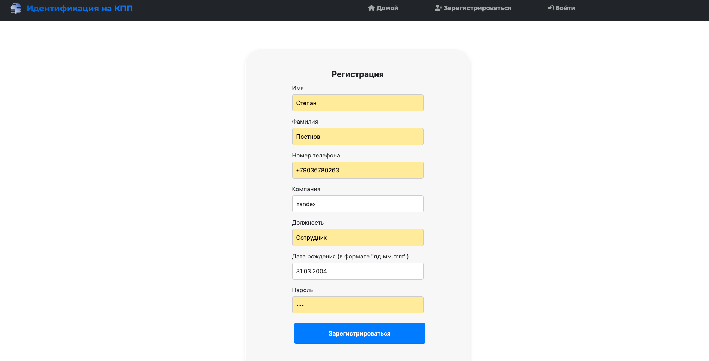
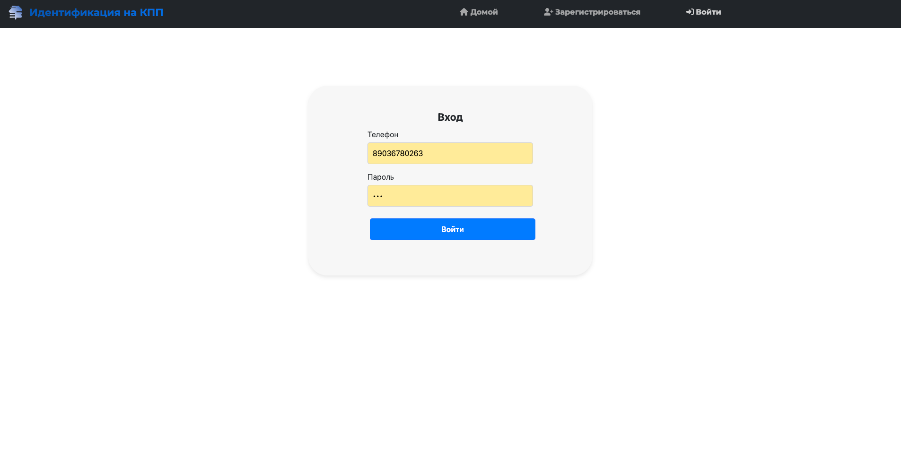
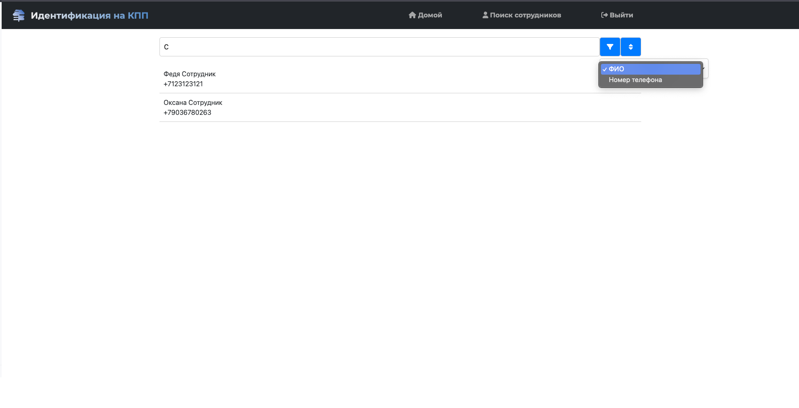
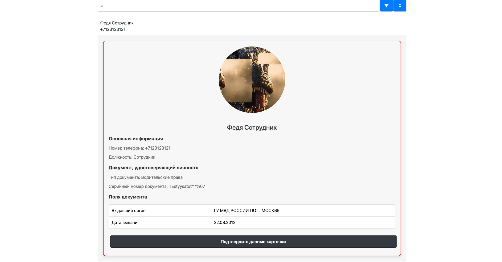
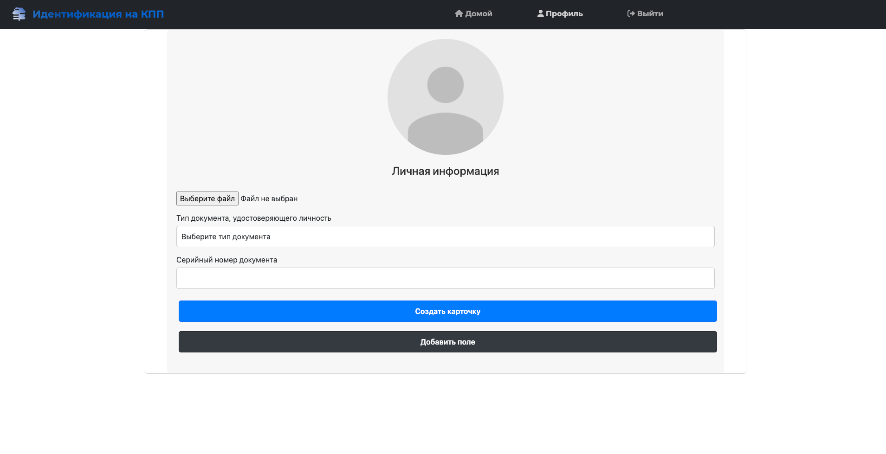

# Приложение для идентификации сотрудников компании на КПП

## Краткое описание проекта

Приложение для идентификации сотрудников компании на КПП. Разрабатываемый программный продукт позволяет сотруднику СБ быстро и качественно организовывать мероприятия по обеспечению безопасности на объектах.

## Краткое описание предметной области

Предметной областью является сфера безопасности (в частности, организация безопасности каких-либо объектов)

## Краткий анализ аналогичных решений

Решение                                      | Поиск сотрудников по различным параметрам | Хранение документа, удостоверяющего личность | Возможность саморегистрации сотрудником | 
-------------------------------------------- |-------------------------------------------|----------------------------------------------|-----------------------------------------
[ИНФОСТАРТ](https://infostart.ru)         | -                                         | -                                            | +                                       |
[PASS24.online](https://pass24online.ru)   | -                                         | -                                            | +                                       |
[Малленом Системс](https://www.mallenom.ru) | -                                         | +                                            | -                                       |
Реализуемое решение                          | +                                         | +                                            | +                                       |

## Краткое обоснование целесообразности и актуальности проекта

В современном мире такая система является очень актуальной и востребованной, так как всегда необходимо поддерживать безопасность в абсолютно разных областях и местах.

## Краткое описание акторов (ролей)

В проекте присутствуют следующие роли:

- Гость - неавторизованный сотрудник компании
- Сотрудник компании - пользователь, зарегистрированный в сервисе
- Сотрудник СБ - сотрудник компании, обеспечивающий безопасность в рамках компании

## Use-Case

## ER-диаграмма

## Диаграмма БД

## Сценарии использования

- Регистрация сотрудника в приложении:
    1) Сотрудник переходит на сайт
    2) Сотрудник открывает форму для регистрации и регистрируется
    3) Пользователь перенаправляется на страницу со своей информационной карточкой и заполняет ее
- Поиск сотрудника по номеру телефона:
    1) Сотрудник СБ переходит на сайт
    2) Сотрудник СБ переходит на страницу входа и авторизовывается
    3) Сотрудник СБ перенаправляется на страницу со списком всех сотрудников
    4) Сотрудник СБ вводит в поисковую строку, расположенную на той же странице, номер телефона человека
    5) Сотрудник СБ нажимает на кнопку "Поиск" для осуществления поиска
    6) На экране отображается информация о найденном сотруднике или информация о том, что сотрудник не найден
- Получение списка всех сотрудников, отсортированных в порядке убывания по ФИО:
    1) Сотрудник СБ переходит на сайт
    2) Сотрудник СБ переходит на страницу входа и авторизовывается
    3) Сотрудник СБ перенаправляется на страницу со списком всех сотрудников
    4) Сотрудник СБ выбирает поле для сортировки "ФИО"
    5) Сотрудник СБ выбирает порядок сортировки "по убыванию"
    6) На экране отображается список сотрудников

## Формализация ключевых бизнес-процессов

## Разбиение на компоненты

## Экраны будущего приложения

